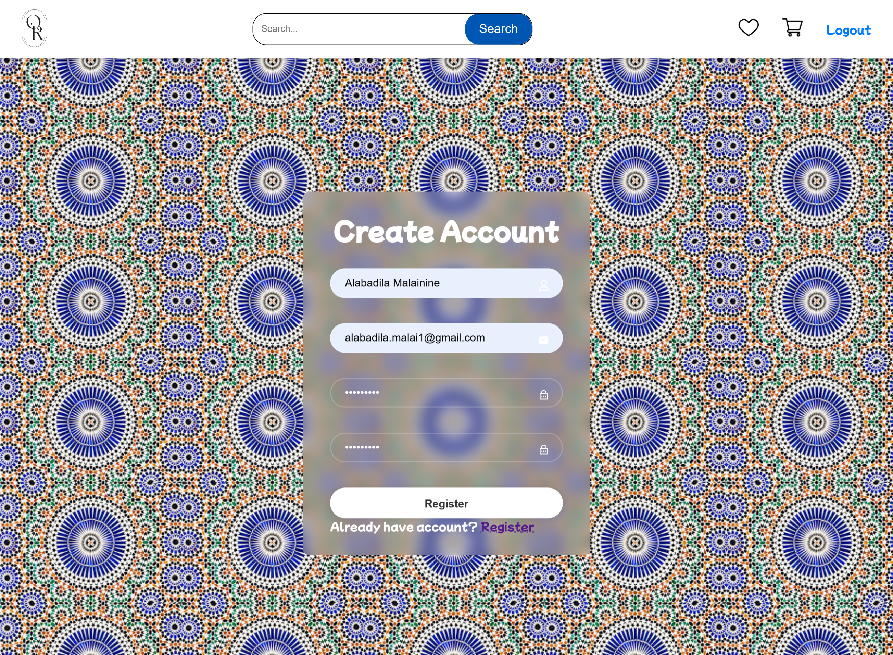
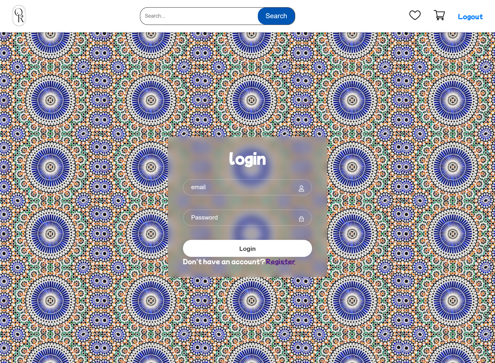

# Project Summary

---

## Project Name
E-Commerce Website

## Description
This project is an e-commerce website developed using React.js and Laravel. It allows users to browse through various categories of products, view product details, add products to cart, and proceed with the checkout process.

## Key Features
1. **Product Listing:** Users can view products organized by categories.
2. **Product Details:** Users can view detailed information about each product, including name, description, price, rating, reviews, tags, and color options.
3. **Category Navigation:** Users can navigate between different product categories.

## Technologies Used
- **Frontend:** React.js, React Router, Axios, CSS
- **Backend:** Laravel (PHP), Eloquent ORM
- **Database:** MongoDB
- **API:** RESTful API for communication between frontend and backend
- **Authentication:** Laravel Breeze for user authentication and session authentication
- **State Management:** React Hooks (useState, useEffect) for managing state in React components
- **Routing:** React Router for client-side routing
- **HTTP

## Images

